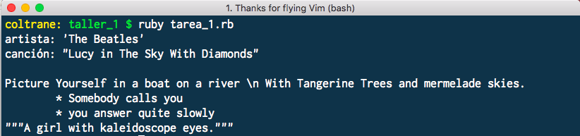

# Tarea 1

Escribir un programa en ruby, que imprima el siguiente texto en pantalla:

```
artista: 'The Beatles'
canción: "Lucy in The Sky With Diamonds"

Picture Yourself in a boat on a river \n With Tangerine Trees and mermelade skies.
<tab>* Somebody calls you
<tab>* you answer quite slowly
"""A girl with kaleidoscope eyes."""
```

### Restricciones

- solo debe haber solo *UNA* funcion `puts` en el programa
- Reemplazar <tab> por un espacio horizontal de verdad (tab)
- El resultado debe ser lo mismo que muestra la imagen adjunta.


Imagen adjunta:


